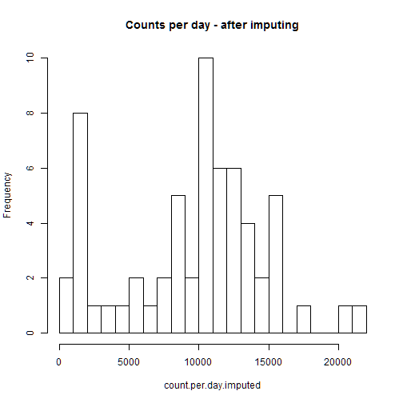

### Part 1: Raw data analysis

In a first step, the data are read and the number and distribution of observations is analyzed. 


```r
library(knitr)
opts_chunk$set(cach.path = 'cache/PA1_FF')
```


```r
activity = read.csv("data/activity.csv")
# determine number of records per date
t1 <- table(activity$date, activity$interval)
dim(t1); min(t1); max(t1)
```

```
## [1]  61 288
```

```
## [1] 1
```

```
## [1] 1
```

We see that there is exactly one record for every 5-minute interval of every day(61 days, 288 intervals per day).

However, there are 2304 missing values for the variable "step". 

For further analysis, I convert the data into a 2D matrix (rows represent days and columns represent intervals).
This easily gives the counts per day. 

```r
tx = tapply(activity$steps,
            list(activity$date, activity$interval),
            sum)
count.per.day = rowSums(tx, na.rm=T)
avg.per.interval = colMeans(tx, na.rm=T)
```

Here is a histogram for the counts per day: 

```r
hist(count.per.day,
     breaks=20,
     main="Histogram 1: Counts per day - with missing values")
```

 

Mean of steps per day is 9354.2295
and the median is 1.0395 &times; 10<sup>4</sup>.

The average activity per interval is as follows:

```r
plot(x=(0:287)/12,          # scale per hour 
     y=avg.per.interval,
     xlab="Interval (scale is hours)",
     type="l",
     main="Average per interval")
```

 

### Part 2: Imputing missing values
As seen above, there are 2304 missing values for the variable "step".

We use the standard impute() function per interval (=column in our matrix), so the missing values are replaced by the interval means. 


```r
library(Hmisc)
```

```r
tx.imputed = tx
for(i in 1:dim(tx)[2])
    tx.imputed[,i] = impute(tx[,i])

count.per.day.imputed = rowSums(tx.imputed)
```

The total number of steps before imputing is 
570608, the total number of steps after imputing has increased to 579736.

Here is a histogram for the counts per day: 

```r
hist(count.per.day.imputed,
     breaks=20,
     main="Counts per day - after imputing")
```

 

Mean of steps per day is now 9503.8689
and the median is 1.0395 &times; 10<sup>4</sup>.

*Since the imputation only changed days with few steps, the median has stayed the same, but the mean has gone up.*

### Part 3: Weekdays vs Weekend Analysis 

For this part of the analysis, we perform the following steps:

* convert the matrix to a data frame

* operate on the row names (=dates) go get the weekdays

* create a logical variable indicating the weekends 

* compute the average steps per group 
 

```r
txd = as.data.frame(tx.imputed)
days = as.POSIXlt(strptime(rownames(txd),"%Y-%m-%d"))
weekend = days$wday >= 5     # use POSIX weekday numbers 

txd.s = split(txd, weekend )     # split weekday / weekend
names(txd.s) = c("weekday","weekend")  # assign names to split
timelines.s = sapply(txd.s, colMeans)  # compute avg. per split
```

Now we could simply plot the two patterns for the weekdays and the weekend. 

In order to get the required lattice graphic layout, we convert the data to a "long" data frame and we convert the time labels to fractions of hours. 
 

```r
df.long =  as.data.frame.table(timelines.s) # get long data frame 
# adjust names 
names(df.long)[1:3] = c("Interval", "Group", "Steps.avg") 
# compute fractions of hour
Int.num = as.numeric(as.character(df.long$Interval))
# separate into hours, minutes and combine 
df.long$Hour = floor(Int.num/100) + (Int.num %% 100)/60
```

Now we can create the lattice plot 

```r
xyplot(Steps.avg ~ Hour | Group,
       data=df.long,
       type="l",
       xlab="Interval",
       xlim=c(0,24),
       ylab="Average number of steps",
       layout=c(1,2))
```

 
 


